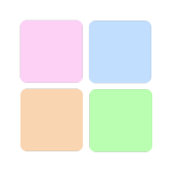
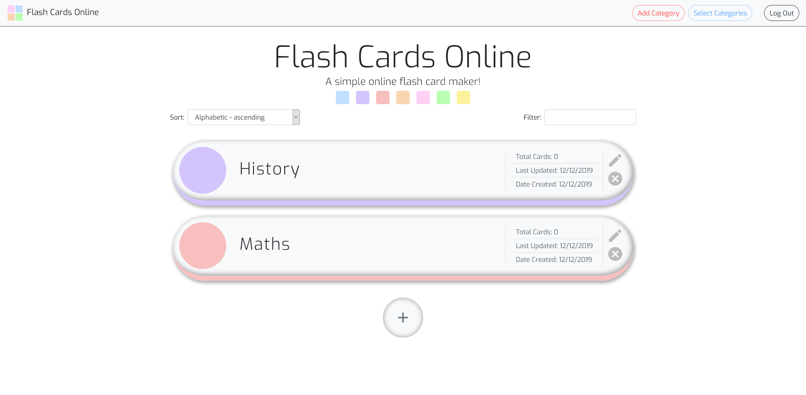
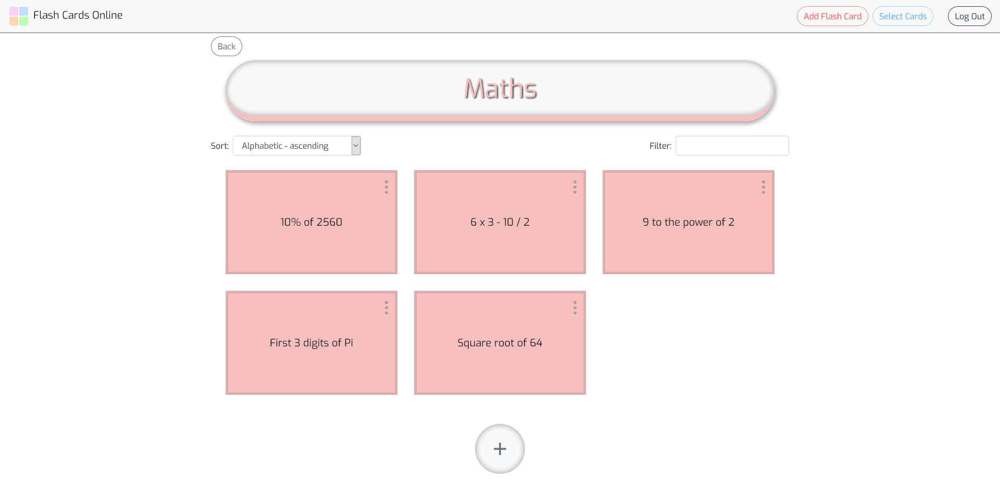

# Flash Cards Online
> An educational tool for building flash cards online!

## Table of contents
* [Description](#description)
* [Features](#features)
* [How To Use](#how-to-use)
* [Screenshots](#screenshots)
* [Built With](#built-with)
* [Contact](#contact)

## Description
**Flash Cards Online** is a full-stack web application that makes building flash cards in distinct categories easy! Sign in, create a category and start making flash cards consisting of a "header" on the front and "content" on the back, which can be hidden/revealed.

This educational tool is designed to be used for note-taking and revision purposes. The mongoDB back-end means you can login and retrieve your flash cards from anywhere!

## Features
* login using google/facebook
* CRUD functionality with categories/flash cards
* option to select and delete multiple categories/flash cards
* sort categories/flash cards using dropdown 
* filter categories/flash cards using filter input

## How To Use
1. Click the "+" button, or the "Add Category" button in the header
2. Type in a category name, choose a colour and click "Submit"
3. Click on the new category to enter it
4. Click the "+" button, or the "Add Flash Card" button in the header
5. Type in a header, content and click "Submit"
6. Click on the flash card to hide/reveal the header/content

## Screenshots

## Built With
* HTML
* CSS
* JavaScript
* Bootstrap - 4.3.1
* react - 16.11.0
* react-router-dom - 5.1.2
* redux - 4.0.4
* redux-form - 8.2.6
* express - 4.17.1
* mongoose - 5.7.7
* passport - 0.4.0
* node - 10.16.0
* npm - 6.9.0

## Contact
Created by Guy Owen - guy.owen@virginmedia.com